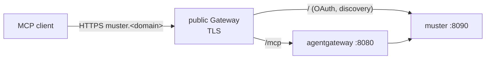

# Authentication flow

How a request authenticates against the Agent Platform. Every person signs in at one OIDC provider (Dex, `global.identity`); muster is the OAuth resource server and authorization server for MCP clients; agentgateway verifies tokens at the edge only on the routes listed in [4](#4-edge-jwt-validation-and-jwks). Install and registration steps are in [install.md](install.md); every value is in [reference.md](reference.md).

## 1. The request path

A client is given one URL: **`https://muster.<domain>/mcp`** (`ingress.hostnames` overrides the hostname). `ingress.mode` decides what sits behind it:

| `ingress.mode` | Behind `muster.<domain>` |
|---|---|
| `agentgateway-muster` (default) | Two routes on the same hostname: `/mcp` goes to the agentgateway data plane (`:8080`), which forwards it to muster; every other path (`/.well-known/*`, `/oauth/*`, registration) goes straight to muster. Gateway API path specificity (`/mcp` beats `/`) splits them. |
| `muster-direct` (deprecated) | One route, `/` to muster. No agentgateway. Needs `components.agentgateway.enabled: false` and `agent-platform-mcps.agentgateway.viaMuster: false` too. The kind example uses it. |
| `agentgateway-direct` | Refused at render: it needs an IdP with dynamic client registration (RFC 7591/8707). |



With the chart-owned edge (`gatewayApi.gateway.create: true`) the agentgateway data plane *is* the public Gateway, and the separate `/mcp` route is not rendered: muster's hostname-specific route serves `/mcp` too. The client URL is the same.

muster validates every token itself. agentgateway on the MCP path passes the bearer through unverified.

## 2. OAuth discovery

All of it happens on muster's hostname:

1. `GET /mcp` without a token returns `401` with `WWW-Authenticate: Bearer resource_metadata=…/.well-known/oauth-protected-resource`.
2. The protected-resource metadata names muster as the authorization server; `/.well-known/oauth-authorization-server` gives its registration and token endpoints.
3. The client registers (gated: [install.md §5](install.md#5-after-the-install)), signs the person in at Dex through `https://muster.<domain>/oauth/callback`, and retries `/mcp` with the token.

A Gateway that rewrites error responses can strip `WWW-Authenticate`, and clients then cannot find the authorization server. On Envoy Gateway, `ingress.backendTrafficPolicy.enabled: true` renders route-scoped `BackendTrafficPolicy` objects that keep the header and lift the request timeout for streams (`timeout: "0s"`). It is off by default. It covers muster's route in every mode, and the `/mcp` route when that route is rendered.

## 3. Token handling at muster

muster aggregates many MCP servers behind `/mcp`. Each server entry in `agent-platform-mcps.mcpServers` declares how muster obtains the token it sends there (the [agent-platform-mcps](https://github.com/giantswarm/agent-platform-mcps) values: `auth`, `identityProviders`):

| `auth.mode` | When | Mechanism |
|---|---|---|
| `forward` | The server trusts the issuer the caller signed in with (typically the same cluster). | The person's bearer goes through unchanged. |
| `exchange` | The server sits behind a different issuer (another cluster's Dex). | muster performs an [RFC 8693](https://www.rfc-editor.org/rfc/rfc8693) token exchange at that issuer's token endpoint, with the client credentials of the `identityProviders.<provider>` entry. |

muster signs no tokens of its own: every downstream server validates against Dex. A kagent agent acts as the person who invoked it: the Harness propagates that person's token (`KAGENT_PROPAGATE_TOKEN`) as the only `Authorization` reaching muster. model-manager, agent-manager and mcp-kubernetes receive the person's token with the audience `dex-k8s-authenticator` and act on the cluster with that person's RBAC (install.md, [The identity provider](install.md#the-identity-provider)).

## 4. Edge JWT validation and JWKS

agentgateway verifies the JWT itself (`Strict`, against `global.identity.issuerUrl`) on three routes: the kagent controller route ([5](#5-the-kagent-controller-route)), the agent-manager route (`agentManager.route`, off by default) and the models Gateway ([6](#6-the-models-gateway)). Each takes its key set from its own `jwtAuthentication.jwks` (`host`, `port`, `path`, `tls`). The agentgateway controller fetches it and pushes the keys to the data plane. A failed fetch refuses every caller with `401 token uses the unknown key`.

An in-cluster issuer (for example Dex on `:5556` in another namespace) needs `gateway.jwksEgress.enabled: true` with that `namespace` and `port`; the render fails when a route names an in-cluster JWKS host the egress rule does not open. An external issuer on 443 needs no rule.

## 5. The kagent controller route

`kagent.controllerRoute.enabled` (off by default; rendered with `components.kagent` on) exposes the kagent controller's API: the kagent API v2 gRPC services and A2A v1, native gRPC or gRPC-Web. The controller authorizes nothing on its own, so it is reachable only through two authentication boundaries:

- **agentgateway** (`GRPCRoute kagent-controller`, `kagent-controller-public`), with `AgentgatewayPolicy kagent-controller-jwt`. JWT validation is on by default (`kagent.controllerRoute.jwtAuthentication`). A token is required and must carry the identity claim, `kagent.controller.auth.userIdClaim` (`email`). The policy **sets** `x-user-id` from the verified claim, which replaces any value the client sent, and passes the bearer through.
- **the kagent UI** (`kagent.uiRoute` behind `kagent.oauth2-proxy`). Its route removes `x-user-id`, and the bearer comes from the oauth2-proxy session.

The controller (`kagent.controller.auth.mode: trusted-proxy`) takes the caller from the bearer's `email` claim. It never verifies a signature, so its network policy admits only the agentgateway data plane and the UI pods on `:8083`.

| Request | At the gateway |
|---|---|
| no token, foreign issuer, expired or bad signature | `401` |
| valid token without the identity claim | `403` |
| valid token | passed through, `x-user-id` = the claim |

No audience is required: every Dex client a person signs in with is accepted.

Before turning the route on, set `kagent.controllerRoute.parentRef` (its default names a Giant Swarm Gateway; clear `name` to fall back to the chart-owned edge or `global.gatewayApi.parentRefs`) and `kagent.controllerRoute.jwtAuthentication.jwks` with `gateway.jwksEgress` for your issuer ([4](#4-edge-jwt-validation-and-jwks)).

Reaching the controller:

| From | Target | Transport |
|---|---|---|
| the portal backend, a CLI | `https://agentgateway.<domain>` (`kagent.controllerRoute.hostname`; the portal's `apiBaseUrl`) | gRPC over HTTP/2, or gRPC-Web |
| klaus-gateway and other in-cluster clients | `grpc://agentgateway.<release namespace>.svc.cluster.local:8080` (the `klausGateway.a2a.url` default) | plaintext HTTP/2 (h2c) |

`kagent.controllerRoute.jwtAuthentication.enabled: false` removes the policy, and the controller then trusts `x-user-id` as sent. Use it only for local development.

## 6. The models Gateway

A model served by the serving slice ([reference](reference.md#the-serving-slice-and-the-models-gateway)) is reached through its own Gateway, `models.<domain>` (`modelServing.modelsGateway.hostPrefix` + `global.domain`). It is never reached through muster. One `AgentgatewayPolicy`, `models-jwt`, sits on the Gateway itself with `Strict` validation and `strategy.inheritance: Override`, so no model route can weaken it:

- **Issuer**: `global.identity.issuerUrl`. The JWKS comes from `modelServing.modelsGateway.jwtAuthentication.jwks` (port 443 by default).
- **Audience**: `dex-k8s-authenticator` only (`jwtAuthentication.audiences`), the login client whose ID token a person holds.
- **Outcome**: `200` with a valid token. `401` without one, or with an expired, foreign-issuer or wrong-audience token, before the request reaches the model. The verified `Authorization` header is stripped before the request reaches the model server.

```text
POST https://models.<domain>/<namespace>/<model>/v1/chat/completions
Authorization: Bearer <id_token>
```
